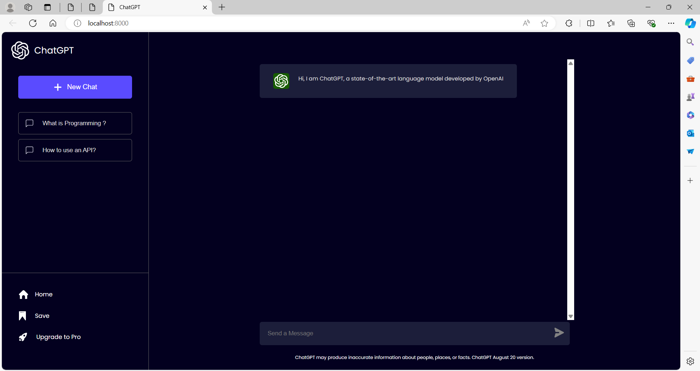

# ChatGPT-clone
- Welcome to the ChatGPT Clone project! This repository contains the code for a web application that mimics the ChatGPT interface, enabling users to interact with an AI chatbot using OpenAI's API.

## Project Overview

- The ChatGPT Clone is a React-based web application that provides an intuitive interface for users to chat with an AI chatbot. The application features a sidebar with preset queries, a main chat area for user-bot interactions, and a footer for user input.

## Features

- **User-Bot Chat Interface:** Users can type messages and receive responses from the chatbot powered by OpenAI's API.
- **Preset Queries:** The sidebar includes preset queries to quickly get responses on common questions.
- **Scrollable Chat History:** The chat area allows users to scroll through their conversation history.
- **Responsive Design:** The application is designed to be responsive and works well on various screen sizes.

## Usage

### Main Components

1. **App Component**
   - The main component that manages the state of the application and renders the sidebar, main chat area, and footer.
   - Handles user input, sends messages to the OpenAI API, and updates the chat history.

2. **Sidebar**
   - Contains the application logo, a button to start a new chat, and preset query buttons.
   - Allows users to quickly ask common questions.

3. **Main Chat Area**
   - Displays the chat history between the user and the bot.
   - Each message is styled based on whether it is sent by the user or the bot.

4. **Footer**
   - Contains the input field and send button for user messages.
   - Displays a disclaimer about the accuracy of the chatbot responses.

### Core Functions

1. **sendMsgToOpenAI**
   - A function to send user messages to the OpenAI API and receive responses.
   - Uses `fetch` to make API requests and update the chat history with bot responses.

2. **handleSend**
   - Triggered when the user sends a message.
   - Updates the state with the user's message, calls `sendMsgToOpenAI`, and updates the chat history with the bot's response.

3. **handleEnter**
   - Allows the user to send a message by pressing the Enter key.
   - Calls `handleSend` when the Enter key is pressed.

4. **handleQuery**
   - Triggered when a preset query button is clicked.
   - Sends the preset query to the OpenAI API and updates the chat history with the bot's response.

## Screenshots

### Chat Interface

## License

This project is licensed under the MIT License. See the [LICENSE](LICENSE) file for details.

## Acknowledgements

- [Create React App](https://create-react-app.dev/) for the React boilerplate.
- [Poppins Font](https://fonts.google.com/specimen/Poppins) for the application font.

- **Get Your OWN OpenAI API**: [OpenAI](https://platform.openai.com/account/api-keys) for providing the API used in this project.

---

I hope you find it useful and engaging. If you have any questions or feedback, please feel free to open an issue or submit a pull request.